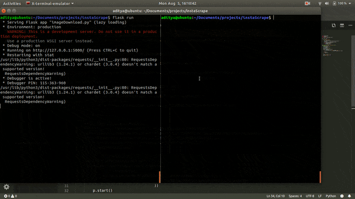
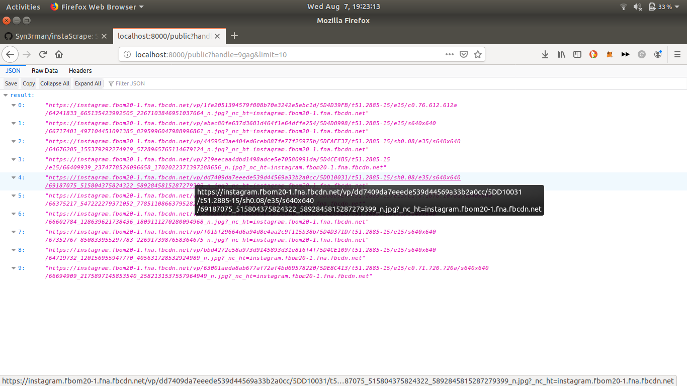

<h3 align="center">InstaScrape</h3>

<div align="center">


[](https://pptr.dev/)


</br>


</div>

------------------------------------------

> Uses headless chrome to scrape specified number of images from instagram for a particular user. Also provides blazing fast download scripts to download the images to your system by leveraging [python's multiprocessing](./download_scripts/dwn.py) and [go routines](download_scripts/main.go).

------------------------------------------

### Features

- [x] Support public profiles
- [x] Support private profiles
- [x] Run with docker
- [x] Go and python scripts to download images


### To-do's

- [ ] Implement image download in rust to compare performance.
- [ ] Try using pyO3 to integrate rust and python to see if there is a significant boost in performance.

### Demo

<div align = "center">

<br>
<br>

</div>


<div align="center">
    <h3>Try it out<h3>
</div>

### Set up locally using git

```
$ git clone https://github.com/Syn3rman/instaScrape.git && cd instaScrape

$ npm install

$ node run.js
```

### Or using docker:
```
$ docker pull syn3rman/instascrape:latest

$ docker run --rm -it syn3rman/instascrape
```

Navigate to [localhost](http://localhost:8001/public?handle=9gag&limit=20) and change the get request parameters as required.

### Downloading images to filesystem

```
$ cd download_scripts

Using python:
$ python3 dwn.py

Using go:
$ go run main.go
```

### Performance

With ~500 image url's, the go script takes around 6-7s to complete while python takes around 12-15s.
